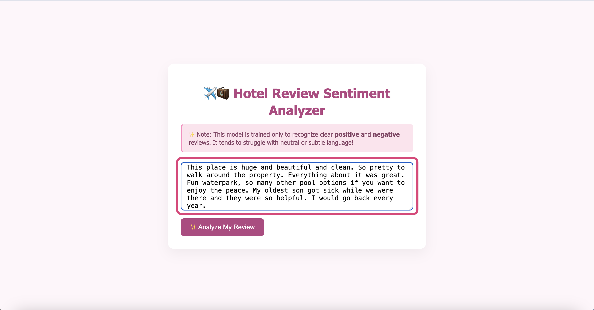

# Hotel Review Sentiment Analyzer - Machine Learning Final 

## Team Members

 | Name | Email | Github User |
 |------|-------|--------------|
 |Katie Martin |krmartin3@mavs.coloradomesa.edu|@katrmartin|
 |Berenice Rascon |brascon@mavs.coloradomesa.edu|@berenicerascon|
 |Molly Kaipus |mkaipus@mavs.coloradomesa.edu |@mkaipus|

 ## How to use the app 
 1. Access the app through this link: [Hotel Review Sentiment Analyzer](https://hotel-reviews-app-72640576c634.herokuapp.com/)
 2. The app is deployed through Heroku, this is the landing page:
    
    
 3. In the text box, paste a hotel review or write your own.
    
    
 4. Click "✨Analyze My Review"
    
    
 5. The app analyzes your review and predicts whether the sentiment is positive or negative, along with a confidence score indicating how certain it is.

    
    
 6. Repeat by inputing as many reviews as you'd like!

 ## Self Grade & Justification

- Full justification can be found here: [Self Grade & Justification](self-grade/MLProject-SelfGrading.pdf)

